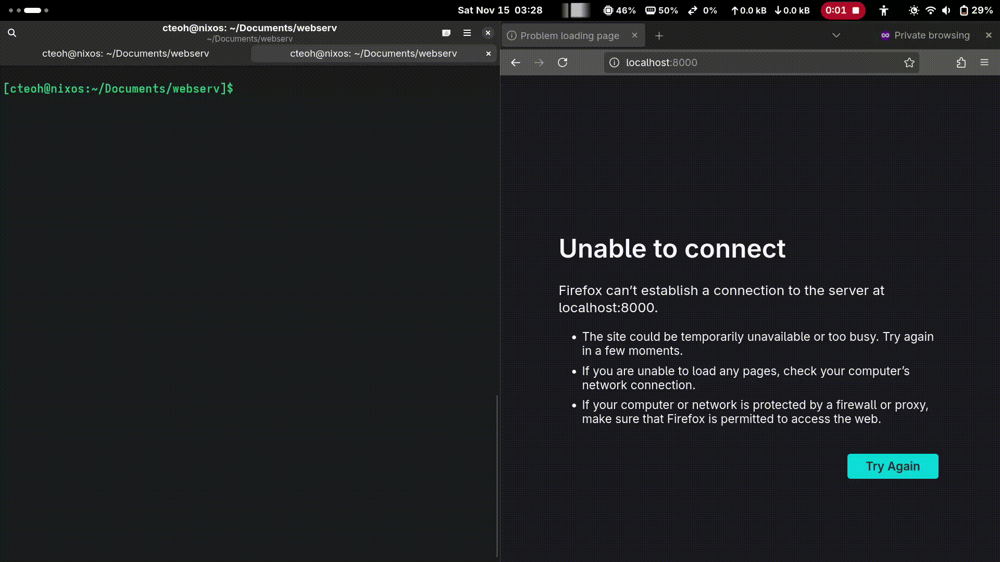

# webserv
This project serves as a means of learning networking, particularly the client-server model, by building a web server from scratch in an object-oriented manner using C++.

The web server utilizes the system networking sockets (Linux `epoll`) and follows the basis of HTTP 1.1 protocol, with Common Gateway Interface (CGI) support.

## Prerequisites
- make
- c++
- Any optional dependencies for CGI execution

## How to run
1. `make`
2. `./webserv [config_name].conf`

## Configuration sample
```
# The absolute path of the project's root directory. It is used to prepend to
# the root and location paths to retrieve the requested resource.
prefix	/home/kecheong/webserv;

http {
	# Specifies a file that contains the mapping between the request's
	# content-type and its extension for the particular resource.
	types mime.types;

	server 1
	{
		# Name of virtual server
		server_name localhost;

		# Port number for the server to listen on. It will always bind to
		# 127.0.0.1.
		listen	 8000;

		# Specifies the resource to return for the listed error code(s).
		error_page 300 300.html;

		# The directory that contains all the web server resources.
		root root;

		# Location block that matches any path that starts with '/'.
		location /
		{
			root	root/pages/;
			error_page 404 503 error.html;

			# HTTP methods allowed in this location block.
			allow_method GET POST;

			# Maximum body size allowed to be sent by client.
			client_max_body_size 2m;

			# Turn directory listing on or off.
			autoindex on;

			# Resource to return if the path does not specify a file and
			# directory listing is off.
			index	index.html;
		}

		location /uploads/
		{
		}

		location /cgi-bin/
		{
			# Turn CGI execution on or off in this location block.
			exec_CGI	on;

			# Specify the resource extensions to be processed as CGI script.
			CGI_script	.py .pl .sh;

			# Turn uploads on or off in this location block. If 'exec_cgi' is
			# on, it will allow CGI scripts to process the uploading. Otherwise
			# the uploads will be processed by the server itself through POST.
			accept_uploads	on;

			# Specifies the directory to upload to. Requires 'accept_uploads'
			# to be on.
			upload_directory	uploads/;
		}
	}
}
```

## Samples
Launching program


## References
- [NGINX](https://nginx.org/)
- [Apache CGI](https://httpd.apache.org/docs/2.4/howto/cgi.html)
